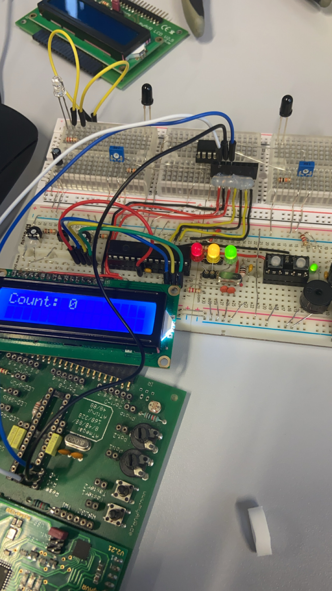
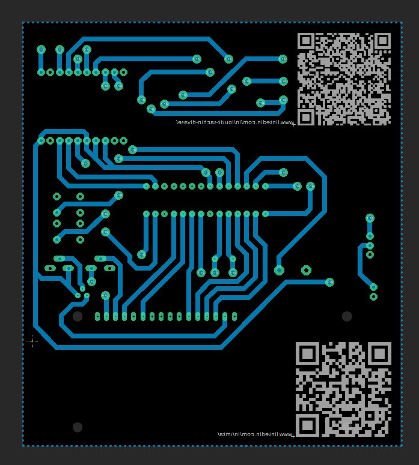

# Occupancy Counter

by: Loukik-Sachin Divase, Rudy Marvyn Kalisetty-Appadu

**Faculty of Technology and Bionics**

***Rhine-Waal University of Applied Sciences***

Date: 16 January 2025

----

## Abstract

The occupancy counter is designed to ensure a seamless flow of people, especially on a busy day. The system tracks the number of people entering and exiting a room and can be used for libraries, offices, toilets, labs, and more. It features real-time monitoring, status indication using LEDs, compliance with safety regulations, and energy-efficient operation. A microcontroller with IR sensors detects directional movement, updates the LCD display accordingly.

## Table of Contents

[[_TOC_]]

## 1 Introduction

Managing space efficiently in crowded environments can be challenging. The people counter helps address this issue by providing real-time tracking of room occupancy.

## 2	Theory

The occupancy counter relies on IR sensors to detect movement direction. The system uses logic to determine whether a person enters or exits, ensuring accurate count tracking. If a person passes through sensor 1(placed outside the room near the door) and sensor 2(placed inside the room near the door), the sensor will count. The sensor will increase the count by 1 if a person passes sensor 1 before sensor 2. The sensor will decrease the count by 1 if the person passes sensor 2 before sensor 1.

## 3	Methodology

### 3.1 Hardware

The system consists of:  
•	Microcontroller (ATmega328p)   
•	16MHz Crystal Oscillator  
•	Infrared LED and photodiode  
•	LCD display (16x2)  
•	Buzzer    
•	LED indicators (Red/Green/Yellow)   
•	battery  
•	Voltage regulator (LM7805)   
•	Dual Comparator (LM393)  
•	resistors  
•	capacitors  
•	inductor  
•	switches  

### 3.2 Software

•	Notepad++ for writing the main program  
•	myAVRboard MK2 for flashing the ATmega328p microcontroller  
•	The program tracks occupancy using IR sensor logic and updates the display accordingly.  

#### Code Snippets

//Reset lock for sensor 1 when signal goes HIGH  

if (sensor1_state && sensor1_locked)  
{  
     sensor1_locked = 0; //Reset lock  
}
            
//Reset lock for sensor 2 when signal goes HIGH  

if (sensor2_state && sensor2_locked)  
{  
     sensor2_locked = 0;  // Reset lock  
}  

## 4 BOM

| No. | Qty. | Manufacturer | Component | Ordering Code (Manufacturer) | Vendor | Ordering Code (Vendor) | Price per Unit (€) | Price (€) | Link |
|----|----|--------------|-----------|-------------------------|--------|----------------|----------------|----------|------|
| 1  | 1  | Texas Instruments | 5V Voltage Regulator SMD | LM7805MPX/NOPB | Mouser | 595-LM7805MPX/NOPB | 1.31 | 1.31 | [Link](https://www.mouser.de/ProductDetail/Texas-Instruments/LM7805MPX-NOPB?qs=gO6GG99qvRCSwIVAoVKHPw%3D%3D) |
| 2  | 4  | Atmel | ATmega328P-PU S | - | HSRW | 1712 | 2.51 | 2.51 |  |
| 3  | 4  | - | 16MHz Crystal Oscillator | QD LFXTALO03240 | Reichelt | - | 0.43 | 0.43 | [Link](https://www.reichelt.de/standardquarz-grundton-16-mhz-iqd-lfxtal003240-p245409.html?&trstct=pos_0&nbc=1) |
| 4  | 2  | - | 22pF Capacitor | RND 150MT15N2202 | Reichelt | - | 0.02 | 0.04 | [Link](https://www.reichelt.de/smd-kerko-0402-22-pf-16-v-1-mlec-rnd-150mt15n2202-p225449.html?&trstct=pos_4&nbe=1) |
| 5  | 4  | - | 10k Ohm Resistor | - | HSRW | 621 | 0.01 | 0.04 | [Link](https://ee.hsrw.org/) |
| 6  | 2  | Vishay/BC Components | 220uF Capacitor, 10V DC | MAL214097403E3 | Mouser | 594-MAL214097403E3 | 1.97 | 3.94 | [Link](https://www.mouser.de/ProductDetail/Vishay-BC-Components/MAL214097403E3?qs=aJI9t0tCUIVP9cSclwINCQ%3D%3D) |
| 7  | 5  | - | LEDs | - | HSRW | 471,497,498 | 0.06 | 0.24 | [Link](https://ee.hsrw.org/) |
| 8  | 7  | - | 220 Ohm Resistor | - | HSRW | 579 | 0.01 | 0.07 | [Link](https://ee.hsrw.org/) |
| 9  | 1  | - | LCD Display 16x2 | DEBO LCD16X2 BL | Reichelt | - | 4.65 | 4.65 | [Link](https://www.reichelt.de/entwicklerboards-display-16-x-2-zeichen-blau-debo-led16x2-bl-p335002.html?&trstct=pos_1&nbe=1) |
| 10 | 1  | - | 28-Pin IC Socket | - | HSRW | 630 | 0.21 | 0.21 | [Link](https://ee.hsrw.org/) |
| 11 | 2  | - | Push Button | TASTER 9305 | Reichelt | - | 0.20 | 0.40 | [Link](https://www.reichelt.de/kurzhubtaster-6x6mm-hoehe-8-Omm-12v-vertikal-taster-9305-p44586.html) |
| 12 | 2  | Everlight | Infrared Diode (940nm, emitter) | IR 7373C EVL | Reichelt | - | 0.15 | 0.30 | [Link](https://www.reichelt.de/infrarot-diode-gaalas-940-nm-50-5-mm-t-1-3-4-ir-7373c-evl-p219706.html?&trstct=vrt_pdn&nbe=1) |
| 13 | 6  | - | 0.1µF Capacitor SM | 0.1/63RAD | HSRW | 372 | 0.03 | 0.18 | [Link](https://ee.hsrw.org/) |
| 14 | 2  | Vishay | Phototransistor (Receiver) | BPV10NF | Reichelt | - | 0.35 | 0.70 | [Link](https://www.reichelt.de/pin-fotodiode-5mm-tageslichfilter-20-60-a-870-950nm-bpv-10nf-p146650.html?&trstct=vrt_pdn&nbe=1) |
| 15 | 4  | Aragonesa de Components | Potentiometer (10k Ohm) | ACP 6-S 10K | Reichelt | - | 0.21 | 0.84 | [Link](https://www.reichelt.de/einstellpotentiometer-stehend-10-kohm-6-mm-acp-6-s-10k-p110242.html?&trstct=vrt_pdn&nbe=1) |
| 16 | 1  | STMicroelectronics | LM393 Comparator | LM393 D STM | Reichelt | - | 0.21 | 0.21 | [Link](https://www.reichelt.de/komparator-18v-36v-2-fach-so-8-lm-393-d-stm-p348702.html?&trstct=pos_O&nbe=1) |
| 17 | 1  | - | 2-Pin Angled Connector (Male) | PSS 254/3W | Reichelt | - | 0.06 | 0.06 | [Link](https://www.reichelt.de/printstecker-einzelstecker-gewinkelt-3-polig-pss-254-3w-p14910.html) |
| 18 | 1  | OURNS | 10µH Inductor, 10% Tolerance | CC453232A-100KL | Mouser | 652-CC453232A-100KL | 0.47 | 0.47 | [Link](https://www.mouser.de/ProductDetail/Bourns/CC453232A-100KL?qs=sPbYRqrBIVk4tmhOTVDWBA%3D%3D) |
| 19 | 1  | - | Battery | - | HSRW | - | 1.00 | 1.00 | [Link](https://ee.hsrw.org/) |
| 20 | 1  | - | 3-Pin Switch | - | HSRW | - | 1.35 | 1.35 | [Link](https://ee.hsrw.org/) |
| 21 | 1  | - | Male Headers | - | HSRW | - | 1.00 | 1.00 | [Link](https://ee.hsrw.org/) |
| 22 | 1  | - | Buzzer | - | HSRW | - | 0.50 | 0.50 | [Link](https://ee.hsrw.org/) |
| 23 | 1  | - | NPN Transistor BC547 | - | HSRW | - | 0.36 | 0.36 | [Link](https://ee.hsrw.org/) |

## 5	Results

### Prototype

### 5.1 Schematic

### 5.2 board

### 5.3 UV Masking

### 5.4 Etching

### 5.5 Drilling

### 5.6 Baking

### 5.7 Testing

### 5.8 Outsourcing

## version 2 (additional)

### Schematic

### Board

## 6	Discussion

The system performs well in controlled conditions. However, environmental factors such as lighting variations may affect sensor accuracy. Calibration is necessary for optimal performance.

What exactly happens? 
The person must pass both sensors to register the count since our product is directional.

## 7	Conclusion

As aspiring engineers, we believe that this project was a success. However, there might be some unsolved challenges that we did not encounter, and we would be more than happy to address them in the future. Future work could involve integrating wireless data transmission for monitoring remotely.

## 8	Power Consumption

Total power consumption: 1.29W, where V = 6V and I = 0.22A

Actual useful power consumption: 1W,  where V = 4.85V and I = 0.21A.

## 9	References

* [1] https://shop.myavr.de/Systemboards%20und%20Programmer/myAVR%20Board%20MK2,%20best%C3%BCckt.htm?sp=article.sp.php&artID=40

* [2] https://docs.arduino.cc/hardware/uno-rev3/

* [3] https://github.com/Loukikdivase/Occupancy-Counter/tree/main/resources
